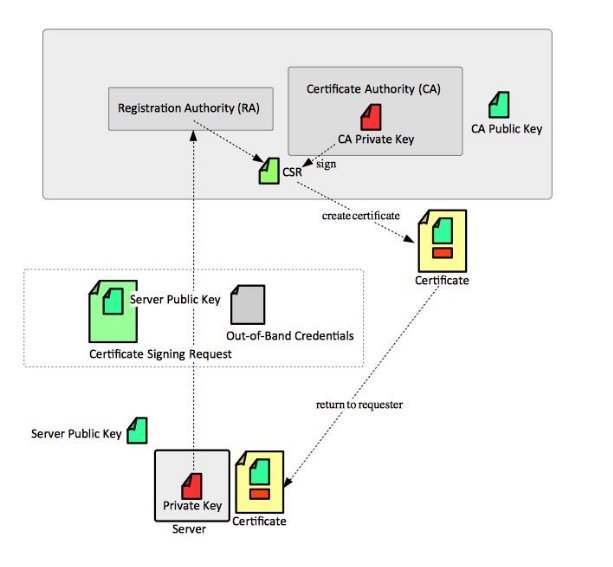

**Mécanismes de certification en Python**

**Implémentation avec pyOpenSSL**

Projet réalisé par Quentin GUARDIA, qg[uardia66@gmail.com ](mailto:qguardia66@gmail.com)

**Table des matières**

[Introduction.............................................................................................................................3 ](#_page2_x56.70_y68.76)[État de l’art sur les certificats.................................................................................................3](#_page2_x56.70_y520.16)

[La paire de clés..................................................................................................................3](#_page2_x56.70_y652.06)

[La signature.......................................................................................................................4](#_page3_x56.70_y155.26)

[Composition du certificat...................................................................................................4 ](#_page3_x56.70_y278.26)[Processus de certification......................................................................................................4](#_page3_x56.70_y533.56)

[Création d’une CA..............................................................................................................4](#_page3_x56.70_y596.46)

[Génération de la CSR........................................................................................................5](#_page4_x56.70_y91.26)

[Création du certificat signé par la CA................................................................................5](#_page4_x56.70_y289.46)

[Extensions utilisées...........................................................................................................5](#_page4_x56.70_y503.76)

[Vérification.........................................................................................................................5](#_page4_x56.70_y638.56)

[Schéma récapitulatif..........................................................................................................6 ](#_page5_x56.70_y56.76)[Implémentation en python......................................................................................................7](#_page6_x56.70_y68.76)

[Shebang.............................................................................................................................7](#_page6_x56.70_y131.66)

[Bibliothèques utilisées.......................................................................................................7](#_page6_x56.70_y241.96)

[Fonctions secondaires.......................................................................................................8](#_page7_x56.70_y244.76)

[Fonctions primaires..........................................................................................................11](#_page10_x56.70_y274.46)

[Schéma des fonctions.....................................................................................................14 ](#_page13_x56.70_y309.46)[Mode d’emploi......................................................................................................................15](#_page14_x56.70_y96.56)

[Un bref manuel................................................................................................................15](#_page14_x56.70_y159.46)

[Création de la CSR..........................................................................................................16](#_page15_x56.70_y56.76)

[Création de la CA............................................................................................................17](#_page16_x56.70_y121.96)

[Signature d’un certificat par la CA...................................................................................17](#_page16_x56.70_y462.36)

[Vérification du certificat signé..........................................................................................18](#_page17_x56.70_y81.26)

[Gestion de mauvaises entrées........................................................................................18 ](#_page17_x56.70_y634.86)[Conclusion...........................................................................................................................20 ](#_page19_x56.70_y62.36)[Sources................................................................................................................................20](#_page19_x56.70_y547.96)

[Images.............................................................................................................................20](#_page19_x56.70_y610.86)

[Références.......................................................................................................................21](#_page20_x56.70_y56.76)[Annexe.................................................................................................................................21](#_page1_x538.00_y493.46)

**Introduction**

Internet offre la possibilité de mettre en relation des clients avec des serveurs. Mais comment s’assurer de l’authenticité de ces entités ? Et comment être sûr que les données restent confidentielles lors des échanges ? Tout simplement, par l’usage de certificats. Ainsi, le certificat assure deux rôles principaux : il sert à certifier l’identité d’un tiers et chiffrer les échanges avec celui-ci.

Le certificat doit être signé par une Autorité de Certification (CA), qui atteste l’identité de la personne, de la machine ou du service associé. Ainsi une entité peut demander à être certifiée par une CA via une requête de signature (CSR). L’autorité d’enregistrement vérifie préalablement l’identité du demandeur. Ainsi, une sécurité maximale est offerte.

De plus, les CSR et signatures de certificats par des CA nécessitent un jeu de clés publique/privée pour plus de sécurité, comme nous l’expliquerons par la suite.

Nous proposons dans ce projet d’automatiser la création de :

- CSR
- CA
- signature de certificat

Et en prime la vérification de la correspondance clé privée/certificat et de la signature du certificat. Il sera possible de choisir l’algorithme de chiffrement pour les clés (RSA ou DSA), ainsi que la longueur en bits de la paire de clés.

Nous implémenterons cette automatisation en Python sous Linux. Pour cela, nous nous appuyons sur la bibliothèque pyOpenSSL qui se base sur le standard X.509 pour la création de certificats, soit le standard le plus utilisé. Il est défini par le RFC 5280.

**État de l’art sur les certificats**

Comme  évoqué  précédemment,  un certificat  numérique  est  une  carte  d’identité électronique dont le but est d’authentifier un utilisateur, un équipement informatique  ou un serveur  d’application  sécurisé.  Plusieurs  éléments  sont  détenus  dans  un  certificat. D’abord, faisons un petit rappel sur les mécanismes de sécurité.

**La paire de clés**

Une paire de clés est associée à chaque certificat : une clé privée protégée par le propriétaire du certificat et une clé publique incluse dans le certificat. Ces deux clés sont générées en même temps et sont obtenues à l’aide d’un algorithme de chiffrement asymétrique tel que RSA, ou encore DSA. Il faut donc que ces clés soient suffisamment longues pour que la clé privée ne soit pas retrouvée grâce à la clé publique. On préconise une longueur de 2048 bits.

Pour  illustrer,  l’expéditeur  peut  chiffrer  ses  messages  avec  sa  clé  privée,  et  les destinataires peuvent lire en déchiffrant à l’aide de la clé publique. Inversement, les destinataires peuvent répondre en chiffrant un message à l’aide de la clé publique, que seule la personne initiale peut déchiffrer à l’aide de sa clé privée. Cela assure l’intégrité et la confidentialité des messages.

**La signature**

La signature consiste à appliquer une fonction de hachage aux données pour les transformer en une empreinte. Ensuite, l’empreinte est chiffrée avec la clé privée de l’expéditeur. L’empreinte se calcule avec une fonction de hachage, comme SHA-256. Cette signature assure l’authentification, la non-répudiation et l’intégrité des données.

**Composition du certificat**

Ainsi, le certificat numérique est composé de :

- la clé publique du tiers
- un Serial Number pour que la CA puisse identifier le certificat
- informations identifiant le porteur de cette paire de clés (qui peut être une personne ou  un  équipement),  telles  que  son  nom,  son  adresse  IP,  son  adresse  de messagerie électronique, etc
- l'identité de la CA
- durée de vie du certificat
- la signature numérique de toutes les données ci-dessus par la CA
- l’algorithme utilisé pour la signature

**Processus de certification**

**Création d’une CA**

Pour que certification il y ait, il doit avant tout y avoir une CA. La CA existe à travers son certificat. Dans notre programme, il s’agira d’un certificat auto-signé. Il sera son propre émetteur. Il faudra avant tout créer une paire de clés. La clé publique sera associée au certificat. La clé privée signera le certificat avec la fonction de hachage SHA256. Il faut conserver précieusement la clé privée, d’autant plus qu’elle servira à signer d’autres certificats. De nombreux éléments seront contenus dans le certificat de la CA, dont son sujet (par exemple, l’adresse du site web), sa durée de vie ou son Serial Number.

**Génération de la CSR**

La Certificate Signing Request est une requête qui donne les informations du certificat qu’elle souhaite faire signer auprès de la CA. Ici aussi, il faut d’abord créer une paire de clés. Ça sera la paire de clés associée au futur certificat. La clé publique est à rattacher à la CSR, et la clé privée pour signer la CSR, toujours avec SHA256. On doit remplir de nombreuses informations comme le nom de l’organisme, son pays ou encore l’adresse mail du contact. Ici aussi, les clés sont à conserver précieusement. On envoie la requête auprès de la CA, pour qu’elle signe un certificat avec les informations apportées.

**Création du certificat signé par la CA**

La CA crée un nouveau certificat à partir de la CSR. Pour cela, elle remplit les champs avec les informations contenues dans la CSR. La CA rajoute au certificat :

- la clé publique de la CA
- l’identité de la CA pour l’émetteur
- une durée de vie
- le Serial Number, qui est aléatoire dans notre programme

Le certificat est signé avec la clé privée de la CA et toujours l’algorithme de SHA256. Le certificat est prêt !

**Extensions utilisées**

Enfin, voici une dernière précision concernant les extensions des fichiers que nous utiliserons. Les clés privées et publiques seront enregistrées dans des fichiers .pem. Les CSR dans des fichiers .csr. Et les certificats dans des fichiers .crt.

**Vérification**

Nous avons en plus ajouter la possibilité de vérifier, d’une part la correspondance entre la clé privée et le certificat, d’autre part la validité de la signature de la CA.

**Schéma récapitulatif**

CSR passant par la RA avant de créer un certificat signé par la CA

**Implémentation en python**

**Shebang**

La première ligne permet au système d’exécuter le fichier comme un programme en lui indiquant l’interpréteur à utiliser, ici python3.

#!/usr/bin/env python3

**Bibliothèques utilisées**

Pour vérifier l’existence des fichiers à ouvrir ou vérifier qu’un fichier sur le point d’être enregistrer n’a pas un homonyme :

|from pathlib **import** Path|
| - |
|**import** os.path|
Pour le Serial Number aléatoire lors de la création d’un certificat par la CA : **import** random **as** rd

Pour créer le parseur d’arguments

**import** argparse

Pour installer les bibliothèques manquantes, on fait un appel système si l’on rencontre une erreur lors de l’import. Pour la bibliothèque pyOpenSSL, on donne aussi en cas d’erreur la commande  à  exécuter  pour  éventuellement  installer  les  paquets  manquants.  Pour PyCryptodome, importée sous le nom de Crypto.PublicKey, on vérifie de plus que la version soit supérieure ou égale à 3, pour éviter d’utiliser la version obsolète PyCrypto. PyCryptodrome nous servira à chiffrer les clés privées avec une passphrase, car bien que pyOpenSSL propose cette option, elle ne marche pas en pratique.

On s’est par ailleurs assurés de la présence de pip en installant PyOpenSSL, car c’est grâce à ce module que nous installons les bibliothèques non-standards manquantes.

|**import** subprocess|
| - |
|**import** sys|
|**import** os|
|**try**:|
|**from** OpenSSL **import** crypto, SSL|
|**except** ImportError:|
|**try**:|
|`                `subprocess.check\_call([sys.executable, "-m", "pip", "install", "pyOpenSSL"])|
|**except**:|
|`                `subprocess.check\_call(["sudo","add-apt-repository", "universe"])|
|`                `subprocess.check\_call(["sudo","apt", "update"])|
|`                `subprocess.check\_call(["sudo","apt", "install", "python3-pip"])|
|`        `subprocess.check\_call([sys.executable, "-m", "pip", "install", "pyOpenSSL"])|
|`        `print("Veuillez éxecuter le programme à nouveau")|
|`        `exit(0)|
||
|**try**:|
|**import** Crypto.PublicKey|
|**from** Crypto.PublicKey **import** RSA,DSA|
|**if** int(Crypto.\_\_version\_\_[0])<3:|
|`                `subprocess.check\_call([sys.executable, "-m", "pip", "install", "-U", "pycryptodome"])|
|**except** ImportError:|
|`        `subprocess.check\_call([sys.executable, "-m", "pip", "install", "-U", "pycryptodome"])|
|**from** Crypto.PublicKey **import** RSA,DSA|
**Fonctions secondaires**

**entree\_non\_vide**

C’est une fonction qui permet d’assurer qu’une entrée ne soit pas vide. Une entrée vide peut provoquer une erreur au moment de remplir les champs d’informations dans la CSR ou dans le sujet du CA. Pour cela, on fait itérer une boucle qui s’arrête lorsque la variable entree n’est plus nulle.

|**def** **entree\_non\_vide**(texte):|
| - |
|`        `entree=""|
|**while** entree=="":|
|`                `entree=input(texte)|
|**return** entree|
**entree\_entier**

De la même manière, on vérifie que certaines entrées soient bien des chiffres, comme le champ concernant le nombre de domaines alternatifs dans la CSR ou encore la taille en bits de la clé. On a implémenté cela grâce à une structure try/except et une valeur par défaut, avec un or suivi d’une valeur après l’input.

|**def** **entree\_entier**(texte,defaut):|
| - |
|`        `entree=input(texte) **or** defaut|
|**try**:|
|**return** int(entree)|
|**except**:|
|`                `print("Nombre incorrect")|
|**return** entree\_entier(texte,defaut)|
**enregistrer\_fichier**

Pour enregistrer  un fichier,  on appelle la fonction enregistrer\_fichier qui prend  en paramètres  l’extension  du  fichier :  pem,  csr  ou  crt  avec  l’objet  associé :  key, certificate\_request ou certificate. On demande un nom pour le fichier et on vérifie que le fichier n’existe pas déjà avant de l’enregistrer, grâce à Path() et is\_file(). De même, le nom du fichier ne peut pas être vide.

|**def** **enregistrer\_fichier**(ftype, objet):|
| - |
|`        `nom=entree\_non\_vide("Sous quel nom enregistrer le fichier ."+ftype+" ?\ n")|
|**if** Path(nom+"."+ftype).is\_file():|
|`                `print("Fichier existant, veuillez choisir un nouveau nom")|
|**return** enregistrer\_fichier(ftype, objet)|
|`        `sortie = open(nom+"."+ftype, "w")|
|`        `sortie.write(objet.decode("utf-8") )|
|`        `sortie.close()|
**enregistrer\_cle**

La fonction pour enregistrer la paire de clés fait appel à la fonction ci-dessus. Plus exactement, la fonction prend une paire de clés en paramètre. Elle emploie dump pour convertir chacune des clés en chaîne de caractères. Puis pour chaque clé sous le format str, publique et privée, elle appelle la fonction enregistrer\_fichier avec l’extension pem. On propose à l’utilisateur de rentrer une passphrase pour enregistrer la clé privée. Cela assure une sécurité complémentaire.

|**def** **enregistrer\_cle**(cle,type\_c):|
| - |
|`        `print("On enregistre la clé privée")|
|`        `passphrase=input("Passphrase (optionnel):")|
|**if** passphrase != "":|
|`                `enregistrer\_passphrase(cle,passphrase,type\_c)|
|**else**:|
|`                `cle\_privee = crypto.dump\_privatekey(crypto.FILETYPE\_PEM, cle)|
|`                `enregistrer\_fichier("pem", cle\_privee)|
||
|`        `print("On enregistre la clé publique")|
|`        `cle\_publique = crypto.dump\_publickey(crypto.FILETYPE\_PEM, cle)|
|`        `enregistrer\_fichier("pem", cle\_publique)|
**ouvrir\_fichier**

Pour ouvrir un fichier, on appelle ouvrir\_fichier qui prend en paramètre un type de fichier: crt pour un certificat, csr pour une CSR et clé privée pour un fichier pem. La fonction demande à l’utilisateur de donner le chemin du fichier. Si le chemin existe, alors le programme lit le fichier et convertir la chaîne récupérée vers le bon type. En cas d’erreur, on précise que le fichier entré n’est pas au bon format puis on rappelle la fonction pour réitérer. À noter qu’ici, si on ouvre une clé privée chiffrée à l’aide d’une passphrase, alors la passphrase sera automatiquement demandée.

|**def** **ouvrir\_fichier**(type\_fichier):|
| - |
|`        `chemin=input("Chemin pour le fichier "+type\_fichier+" :")|
||
|**if** **not** Path(chemin).is\_file():|
|`                `print("Fichier non trouvé, veuillez réessayer")|
|**return** ouvrir\_fichier(type\_fichier)        |
|`        `fichier=open(chemin, 'rt').read()|
|**try**:|
|**if** str(type\_fichier)=="csr":|
|objet=crypto.load\_certificate\_request(crypto.FILETYPE\_PEM, fichier)|
|**elif** str(type\_fichier)=="crt":|
|`                        `objet=crypto.load\_certificate(crypto.FILETYPE\_PEM, fichier)|
|**elif** str(type\_fichier)=="clé privée":|

|**try**:|
| - |
|objet=crypto.load\_privatekey(crypto.FILETYPE\_PEM, fichier)|
|**except**:|
|`                                `print("Passphrase invalide. On recommence.")|
|**return** ouvrir\_fichier(type\_fichier)|
|**except**:|
|`                `print("Le fichier entré n'est pas du bon type, veuillez vérifier")|
|**return** ouvrir\_fichier(type\_fichier)|
||
|**return** objet|
**paire\_cle**

On commence enfin avec le module crypto de pyOpenSSL, avec paire\_cle, la fonction qui permet de générer une paire de clés. On utilise pour cela la méthode Pkey(). On demande à l’utilisateur de choisir entre RSA et DSA pour l’algorithme de chiffrement. Il doit aussi choisir la longueur en bits des clés. Si une valeur incohérente est entrée, alors l’utilisateur doit entrer à nouveau la valeur concernée grâce à la fonction entree\_entier. À la fin, une paire de clés est retournée avec l’algorithme de chiffrement, qui sera pratique de connaître par la suite.

|**def** **paire\_cle**():|
| - |
|`        `print("CRÉATION DE LA PAIRE DE CLÉS")|
|`        `cle=crypto.PKey()|
|`        `type\_c=input("Chiffrement RSA ou DSA ? [R/D]:")|
||
|`        `bits=entree\_entier("Clé de combien de bits ? (2048 par défaut):",2048)|
||
|**if** type\_c **in** {"r","R"}:|
|`                `cle.generate\_key(crypto.TYPE\_RSA, int(bits))|
|**elif** type\_c **in** {"d","D"}:|
|`                `cle.generate\_key(crypto.TYPE\_DSA, int(bits))|
|**else**:|
|`                `print("Choix de chiffrement non valide, veuillez réessayer")|
|**return** paire\_cle()|
||
|**return** cle, type\_c|
**enregistrer\_passphrase**

Enfin, voici la fonction pour enregistrer une clé privée avec une passphrase. PyOpenSSL a normalement implémenté cette fonction, mais on s’est rendu compte qu’elle ne fonctionne pas pour le chiffrement au moment de l’enregistrement, bien que l’ouverture d’une clé chiffrée avec une passphrase demande automatiquement la passphrase. On a donc utilisé la libraire PyCryptodome. Dans un premier temps, on enregistre la clé sans chiffrement dans une fichier temporaire. Puis on la réouvre avec PyCryptodome pour la chiffrer et la réenregistrer sous le nom demandé, avant de supprimer le fichier temporaire.

|def enregistrer\_passphrase(cle,passphrase,type\_c):|
| - |
|`        `sortie = open("tmp.txt", "w")|
|`        `sortie.write(crypto.dump\_privatekey(crypto.FILETYPE\_PEM, cle).decode("utf-8"))|
|`        `sortie.close()|
||
|`        `f = open('tmp.txt','r')|

|**if** type\_c in {"r","R"}:|
| - |
|`                `key = RSA.importKey(f.read())|
|**else**:|
|`                `key = DSA.importKey(f.read())|
|`        `f.close()|
||
|`        `nom=entree\_non\_vide("Sous quel nom enregistrer la clé privée chiffrée (.pem) ?\n")|
|**if** Path(nom).is\_file():|
|`                `print("Fichier existant, veuillez choisir un nouveau nom")|
|**return** enregistrer\_passphrase(cle,passphrase)|
|`        `f = open(nom+".pem",'w')|
|`        `f.write(key.exportKey('PEM',passphrase=passphrase).decode('ascii'))|
|`        `f.close()|
|`        `os.remove("tmp.txt")|
**Fonctions primaires**

**requete\_csr** (côté demandeur de certificat)

Voici la fonction requete\_csr. Elle permet de créer, comme son nom l’indique, une requête CSR. Pour cela, une paire de clés est générée avec la fonction précédemment expliquée. On prend soin de récupérer l’algorithme de chiffrement, RSA ou DSA, pour faciliter l’utilisation de la clé par PyCryptodome. Une création de CSR est demandée avec la méthode  crypto.X509Req(),  qui  respecte  la  norme  X.509.  On  demande  ensuite  à l’utilisateur de rentrer toutes les informations sur l’identité du certificat désiré, y compris les noms des domaines alternatifs si nécessaire, ce qui est un peu plus long à implémenter. On attache la clé publique avec la méthode set\_pubkey(cle) et on signe avec la CSR privée de la sorte : csr.sign(cle, "sha256"). Puis on enregistre la paire de clés et la CSR avec les fonctions précédemment vues.

|**def** **requete\_csr**():|
| - |
|`        `print("CRÉATION DE LA REQUÊTE CSR\n");|
|`        `cle,type\_c=paire\_cle()|
|`        `pays=""|
|`        `liste=list()|
||
|`        `csr = crypto.X509Req()|
|`        `csr.get\_subject().CN = entree\_non\_vide("Nom du certificat: ")|
||
|**while** len(pays)!=2 : pays=input("Pays (2 car.):");|
|`        `csr.get\_subject().countryName = pays|
|`        `csr.get\_subject().stateOrProvinceName = entree\_non\_vide("Région: ")|
|`        `csr.get\_subject().localityName = entree\_non\_vide("Ville: ")|
|`        `csr.get\_subject().organizationName = entree\_non\_vide("Organisation: ")|
|`        `csr.get\_subject().organizationalUnitName = entree\_non\_vide("Unité: ")|
|`        `csr.get\_subject().emailAddress = entree\_non\_vide("Adresse mail: ")|
||
|`        `nb\_san=entree\_entier("Nombre de noms de domaine alternatifs (0 par défaut):",0)|
||
|`        `csr.get\_subject().subjectAltName = str(nb\_san)|
||
|**for** i **in** range(0, int(csr.get\_subject().subjectAltName)):|
|`                `liste.append('DNS:'+input("Nom DNS "+str(i+1)+' :'))|
||
|**if** int(csr.get\_subject().subjectAltName) > 0:|
|`                `csr.add\_extensions([crypto.X509Extension(b'subjectAltName', **False**,','.join(liste).encode())])|
||
|`        `csr.set\_pubkey(cle)|
|`        `csr.sign(cle, "sha256")|
||
|`        `enregistrer\_cle(cle,type\_c)|
||
|`        `csr\_sortie = crypto.dump\_certificate\_request(crypto.FILETYPE\_PEM, csr)|
|`        `print("On enregistre la requête")|
|`        `enregistrer\_fichier("csr",csr\_sortie)|
**creation\_ca** (côté certificateur)

On crée le certificat d’une CA avec creation\_ca. D’abord, on crée une paire de clés avec paire\_cle(). Puis on génère un certificat avec la méthode X509(). On ajoute la version, un Serial Number de 1, l’identité du certificateur (par exemple, l’adresse du site web), la durée de validité. Puis on ajoute les informations du certificat-même pour l’émetteur. C’est la ligne ca.set\_issuer(ca.get\_subject()). On attache la clé publique ici aussi, on ajoute les extensions nécessaires à la CA et on signe avec la clé privée. Une fois de plus, on enregistre la paire de clés sur le disque puis le certificat du certificateur.

|**def** **creation\_ca**():|
| - |
|`        `cle,type\_c=paire\_cle()|
|`        `ca = crypto.X509()|
|`        `ca.set\_version(3)|
|`        `ca.set\_serial\_number(1)|
|`        `sujet=entree\_non\_vide("Sujet de la CA (ex: localhost): ")|
|`        `ca.get\_subject().CN = sujet|
|`        `ca.gmtime\_adj\_notBefore(0)|
|`        `ca.gmtime\_adj\_notAfter(365\*24\*60\*60)|
|`        `ca.set\_issuer(ca.get\_subject())|
|`        `ca.set\_pubkey(cle)|
|`        `ca.add\_extensions([crypto.X509Extension(b"basicConstraints", **True**, b"CA:TRUE, pathlen:0"),crypto.X509Extension(b"keyUsage", **True**, b"keyCertSign, cRLSign"), crypto.X509Extension(b"subjectKeyIdentifier", **False**, b"hash", subject=ca),])|
|`        `ca.sign(cle, "sha256")|
||
|`        `ca\_sortie = crypto.dump\_certificate(crypto.FILETYPE\_PEM, ca)|
||
|`        `print("On enregistre la CA")|
|`        `enregistrer\_fichier("crt",ca\_sortie)|
||
|`        `enregistrer\_cle(cle,type\_c)|
**signature\_cert** (côté certificateur)

On peut maintenant générer un certificat signé à partir d’une CSR et de la CA. Pour cela, on ouvre les fichiers suivants : la CSR, le certificat de la CA et la clé privée de la CA. Ici le certificateur crée un nouveau certificat. Il met le certificat de la CA en émetteur (issuer), il met les données contenues dans la csr dans le nouveau certificat et ajoute la clé publique contenue dans la csr. Ainsi l’entité qui fait la requête aura d’office la bonne clé privée. Le certificateur ajoute par la suite un Serial Number aléatoire et la durée de validité du futur certificat. Il signe le certificat avec la clé privée de la CA, précédemment ouverte. On enregistre le nouveau certificat !

|**def** signature\_cert():|
| - |
|`        `csr=ouvrir\_fichier("csr")|
||
|`        `print("Certificat de la CA:")|
|`        `ca = ouvrir\_fichier("crt")|
|`        `print("Il faut la clé privé de la CA")|
|`        `ca\_cle = ouvrir\_fichier("clé privée")|
||
|`        `serialnb=rd.getrandbits(64)|
||
|`        `cert = crypto.X509()|
|`        `cert.set\_issuer(ca.get\_subject())|
|`        `cert.set\_subject(csr.get\_subject())|
|`        `cert.set\_pubkey(csr.get\_pubkey())|
||
|`        `cert.gmtime\_adj\_notBefore(0)|
|`        `cert.gmtime\_adj\_notAfter(365\*24\*60\*60)|
||
|`        `cert.set\_serial\_number(serialnb)|
||
|`        `cert.sign(ca\_cle, "sha256")|
||
|`        `crt\_sortie = crypto.dump\_certificate(crypto.FILETYPE\_PEM, cert)|
||
|`        `print("On enregistre le nouveau certificat créé")|
|`        `enregistrer\_fichier("crt",crt\_sortie)|
**verif** 

Pour terminer, voici la fonction qui a permis de vérifier la validité de notre travail. Elle offre deux choix. Le premier est la vérification de la correspondance entre la clé privée et le certificat, grâce à la méthode check\_privatekey(). Le second est vérification de la CA qui a validé le certificat, grâce à la méthode verify\_certificate(). Donc, dans notre cas de certificat d’une CA, on peut vérifier qu’il soit bien auto-signé. Toutes ces spécificités sont offertes par le module Crypto de pyOpenSSL.

|**def** **verif**():|
| - |
|`        `choix=input("Vérifier:\n1: La clé privée du certificat\n2: L'émetteur du certificat\nVotre choix:")|
||
|`        `print("On ouvre le certificat à vérifier")|
|`        `client\_cert=ouvrir\_fichier("crt")|
|**if** str(choix) =="1":|
|`                `ctx = SSL.Context(SSL.TLSv1\_METHOD)|
|`                `ctx.use\_certificate(client\_cert)|
|`                `ctx.use\_privatekey(ouvrir\_fichier("clé privée"))|
||
|**try**:|
|`                        `ctx.check\_privatekey()|
|**except** SSL.Error:|
|`                        `print("\nIl n'y a pas de correspondance entre la clé privée et le certificat\n")|
|**else**:|
|`                        `print("\nLa clé privée correspond au certificat\n")|
||
|**elif** str(choix)=="2":|
|`                `print("Certificat de la CA:")|
|`                `serveur\_cert=ouvrir\_fichier("crt")              |
||
|**try**:|
|`                        `store = crypto.X509Store()|
|`                        `store.add\_cert(serveur\_cert)|
||
|`                        `store\_ctx = crypto.X509StoreContext(store, client\_cert)|
|`                        `store\_ctx.verify\_certificate()|
|`                        `print("\nCertificat bien signé par la CA\n")|
||
|**except** Exception **as** e:|
|`                        `print("\nLes certificats ne correspondent pas\n")|
|`                        `print(e)|
|**else**:|
|`                `print("Choix incorrect, veuillez recommencer")|
|`                `verif()|
**Schéma des fonctions**

Juste après, un schéma récapitulant les relations entre les fonctions. Par soucis de clarté, on a volontairement amis les fonctions les moins utiles, telles que celles vérifiant que l’entrée soit correcte ou encore celle permettant de chiffrer la clé privée.

**Mode d’emploi**

**Un bref manuel**

D’abord, voyons ce que propose le programme si on l’exécute tel quel. Pour cela, on exécute dans un terminal, ouvert dans le dossier du programme code.py :

./code.py

S’il y a bien droit d’exécution, on apprend les commandes possibles. Il existe d’abord l’argument --help, qui ne permet en réalité que d’afficher la présente sortie.

` `Du côté du demandeur      :

- L’argument --csr sert à un utilisateur souhaitant faire une demande de certificat signé auprès d’une CA.

` `Du côté du certificateur      :

- L’argument --ca sert à créer une CA.
- L’argument --sign sert à générer une certificat à partir d’une CSR et d’une CA.

L’argument --verif permet de tester la validité des sorties fichier. Mettons cela en pratique !

**Création de la CSR**

On commence par créer une CSR. Il faut pour cela générer les clés et choisir leurs caractéristiques. Puis on complète les informations du certificat que l’on veut créer. Enfin, on enregistre. Pour cela, on exécute dans le terminal :

./code.py --csr

Puis on complète. Voici un exemple :

On peut vérifier l’existence des fichiers créés et leur cohérence avec cat :

On peut faire de même avec les fichiers cert\_priv.pem et cert\_pub.pem, qui sont également corrects d’après nos vérifications. On va maintenant essayer de faire valider cette CSR auprès d’un certificateur.

**Création de la CA**

Nous sommes à présent du côté du certificateur. On génère des clés avant de donner notre identificateur. Puis, on enregistre les clés et le nouveau certificat auto-signé :

./code.py --ca 

**Signature d’un certificat par la CA**

Le certificateur peut maintenant créer le certificat signé. Pour cela, il sélectionne le certificat de la CA, sa clé privée et le fichier de la CSR.

./code.py --sign

Pour poursuivre l’exemple, on obtient :

**Vérification du certificat signé**

On peut à présent vérifier la clé privée et la signature de notre nouveau certificat, en deux étapes. Pour cela, sélectionne d’abord le premier choix. On renseigne alors, le nouveau certificat et la clé privée créée au début. Puis on relance la commande, avec cette fois le second choix. Il faut pour celui-ci renseigner le nouveau certificat et enfin le certificat certificateur.

La commande correspondante est la suivante :

./code.py --verif

Puis il faut faire son choix : 1 ou 2.

Ce qui nous donne le résultat ci-dessous.

Tout est valide !

**Gestion de mauvaises entrées**

Voici un exemple de gestion de mauvaises entrées par le programme. Ici, nous avons entré des lettres à la place d’un entier pour la longueur des clés de la CSR. Puis, nous avons sélectionner un nom de clé publique déjà existant, et un nom de clé privée vide. Le résultat est le suivant :

**Conclusion**

Nous avons pu voir le long de ce projet, comment il était possible d’automatiser la création de CSR pour un organisme demandeur, et de CA et certificats signés pour un organisme certificateur. Cela en python avec des bibliothèques pyOpenSSL et PyCryptodome. Il a pour cela fallu implémenta de nombreuses fonctionnalités, comme la génération d’une paire de clés, nécessaires pour la CSR et la CA. Nous avons bien réussi à créer un certificat à partir d’une CSR par le biais de la CA. Certificat valide comme nous avons pu le vérifier grâce à une fonction prévue à cet effet. Il faut seulement être sous Linux pour bénéficier de l’installation automatique, du paquet pip notamment.

En plus de cela, le programme vérifie que chaque entrée soit correcte pour éviter les erreurs. Si par exemple on rentre un nom de fichier déjà pris lors de l’enregistrement, alors on demande d’entrer une nouvelle valeur.

Par soucis de sécurité, sous souhaitions ajouter la possibilité de chiffrer les clés privées à l’aide d’une passphrase. Nous avons rencontré un problème en implémentant cela. En effet, le paramètre à ajouter au moment de chiffrer et déchiffrer la clé n’avait aucun effet. On a donc, grâce à la bibliothèque PyCryptodome, développé nous-même les fonctions de chiffrement et déchiffrement de clé privée par une passphrase.

Avec un peu plus de temps et de liberté, il aurait également été intéressant d’envoyer une CSR à un serveur distant à l’aide de la bibliothèque python Certsrv. On aurait également pu assurer la vérification des données contenues dans la CSR par une RA, puis faire en sorte de renvoyer le nouveau certificat signé vers le client qui a fait la requête.

**Sources**

**Images**

- Schéma sur le processus de certification: <https://kb.novaordis.com/images/c/c7/PublicKeyInfrastructure.png>
- Schéma récapitulant le rôle des fonctions : œuvre personnelle
- Captures d’écran du mode d’emploi : œuvres personnelles

**Références**

- crypto - Generic cryptographic module, htt[ps://pypi.org/project/pyOpenSSL/](https://pypi.org/project/pyOpenSSL/)
- Internet X.509 Public Key Infrastructure Certificate and Certificate Revocation List (CRL) Profile, [https://tools.ietf.org/html/rfc5280 ](https://tools.ietf.org/html/rfc5280)
- Internet X.509 Public Key Infrastructure Certificate and CRL Profile,  [https://tools.ietf.org/html/rfc2459 ](https://tools.ietf.org/html/rfc2459)
- openssl(1) – Linux manpage, htt[ps://linux.die.net/man/1/openssl](https://linux.die.net/man/1/openssl)
- Welcome to PyCryptodome’s documentation, http[s://pycryptodome.readthedocs.io/ en/latest/ ](https://pycryptodome.readthedocs.io/en/latest/)
